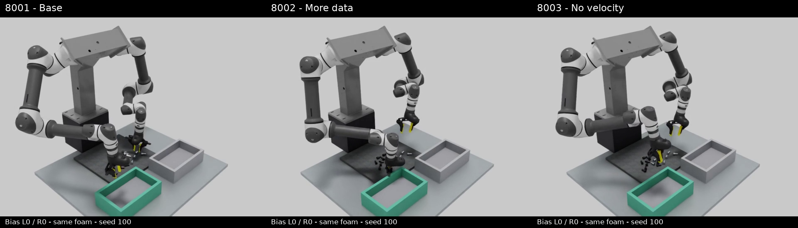

# Isaac Sim 양팔 볼트 pick & place — RB5 + Pika

2026-09-06 기준. **robotics_lab의 policy_runner와 C++ 제어기를 그대로 실행하고,
실제 로봇 대신 PhysX 관절 drive를 연결하는 평가 환경**입니다.
양팔 RB5-850E, Pika v15 그리퍼, M12×25 회색/검정 볼트와 500×500×20mm 폼 패드를 사용합니다.

- [공유 스택 실행·시간·접촉 계약](docs/shared_stack.md)
- [최신 실행 영상·결과·실패 분석](docs/results/20260906/README.md)
- [검증한 의존 저장소 버전](config/stack_versions.json)
- [현재 핸드오프](CLAUDE.md) · [과거 RB3/독립 제어기 기록](docs/archive/README_before_shared_stack_20260906.md)

## 현재 제어 경로

```text
Isaac 양손 손목 RGB / 관절·그리퍼·F/T 측정
  → robotics_lab policy_runner → openpi 모델 서버
  → 기존 command / chunk_overlay.v3
  → C++ rb_isaac_bridge
  → delta_preview → output SMD → 힘 제어 → Pinocchio IK → 안전 필터
  → PhysX 관절 drive
```

PhysX와 C++를 2ms 간격으로 동기화합니다. 렌더는 물리 시간을 추가로 진행시키지 않습니다.
F/T는 tool joint의 실제 반력을 사용하고, 기존 중력 보상·250샘플 tare·force gate를 통과합니다.
팔을 순간이동하거나 볼트를 그리퍼에 강제로 붙여 파지를 재현하지 않습니다.

기본값은 [config/shared_stack.json](config/shared_stack.json)에 있습니다.
anchored/H24, execute 4, runway 4, command anchor/proprio, RTC off, RGB only입니다.
**gripper close bias는 양손 모두 0**입니다. 과거 Sim의 2/6은 Real 성공 설정과 달랐으며,
보정 후 명령이 다음 gripper proprio로 되먹임돼 조기 닫힘과 후속 동작에 영향을 줬습니다.

## 설치와 실행

기본 폴더 구성은 같은 상위 디렉터리의 `simulation/`, `robotics_lab/`, `openpi/`입니다.
`robotics_lab`는 [stack_versions.json](config/stack_versions.json)의 Isaac bridge 포함 버전을 사용합니다.
C++ 의존성 설치는 해당 저장소의 빌드 문서를 따릅니다.

```bash
cd ../robotics_lab
cmake -S rb_servo_server -B rb_servo_server/build
cmake --build rb_servo_server/build -j6
cd ../simulation

uv venv --python 3.12 .venv-isaac
uv pip install --python .venv-isaac/bin/python --prerelease=allow \
  'isaacsim[all,extscache]==6.0.1.0' \
  numpy scipy pillow matplotlib h5py pyyaml imageio imageio-ffmpeg \
  ruckig msgpack 'websockets>=15,<16'

# 별도로 실행 중인 로컬 openpi 모델 서버 사용
scripts/run_shared_stack.sh --port 8001 --episode-sec 30 --tag foam_8001
scripts/run_shared_stack.sh --port 8002 --episode-sec 30 --tag foam_8002
scripts/run_shared_stack.sh --port 8003 --episode-sec 30 --tag foam_8003
```

세 명령은 같은 기본 동결 씬(seed 100), 카메라, 제어 설정을 사용합니다.
동일 GPU에서는 순차 실행합니다. 태그 디렉터리가 이미 있으면 덮어쓰지 않습니다.
런처는 Isaac EULA 환경과 sibling openpi-client의 PYTHONPATH를 설정합니다.
영상 패키징에는 시스템 `ffmpeg`/`ffprobe`가 필요합니다.

```bash
# 모델 추론 없이 연결/정지 상태 확인
scripts/run_shared_stack.sh --shared-hold --episode-sec 1 --no-video --tag hold_check

# 추종/힘 지표
.venv-isaac/bin/python scripts/analyze_shared_stack.py outputs/shared_stack/foam_8001

# 원본 정책 입력을 같은 공통 제어기로 재생
scripts/run_shared_stack.sh --shared-replay outputs/shared_stack/foam_8001 \
  --episode-sec 30 --tag foam_8001_replay
```

[추가 손목 녹화·볼트 자세 기록 및 비교 영상 생성](docs/shared_stack.md#추가-진단-녹화와-비교-패키징)도 가능합니다.
기존 독립 Python 제어기/오라클은 `eval_closed_loop.py`의 legacy 경로로 보존돼 있습니다.
현재 Real–Sim 비교에는 위 공유 스택을 사용합니다.

## 환경과 최신 결과

폼 패드 외관은 최근 Pika 수집 RGB에서 추출한 텍스처에 색상 보정을 적용했습니다.
[work_surface.json](config/work_surface.json)이 치수·위치·외관·접촉 설정의 출처입니다.
[40개 동결 장면](assets/scene_states40_aligned_rb5_foam.json)은 seed 100–139,
각 회색 10개/검정 10개이며, 볼트 전체 형상이 패드 위에 지지되는지 검사합니다.

2026-09-06, **bias 0/0 · 동일 seed 100 · 모델별 30초** 결과:

| 포트 | 체크포인트 | 회색 → 회색 박스 | 검정 → 초록 박스 |
|---|---|---:|---:|
| 8001 | boltv2_plain_40k/39999 | 1 | 0 |
| 8002 | boltv2_r5_40k/39999 | 0 | 0 |
| 8003 | boltv2_griponly_40k/39999 | 1 | 1 |

[세 모델 비교 MP4](docs/results/20260906/8001_8002_8003_comparison.mp4)



이는 한 장면의 단일 실행 결과입니다. 일반적인 성공률이나 Real 모델 순위 검증은 아닙니다.
8003은 서버에서 velocity 12차원을 마스킹하고 gripper 2차원을 유지하는 모델입니다.

손목 카메라는 **수집 에피소드가 싣고 있는 실측 intrinsics**로 렌더합니다. 조리개
17.8885 × 13.4524mm, fx 393.55px입니다. 2026-09-06까지 쓰던 데이터시트 값(20.955,
fx 335.96)은 17% 투영 오차였고, 그 값으로 매긴 보드는 무효입니다
([결과](docs/results/20260907/README.md)). bolt_v2(`data_v2`)로 학습한 체크포인트는
이 실측 광학으로만 채점합니다. `EVAL_H_APERTURE`/`EVAL_V_APERTURE`는 명시적 A/B 전용이며,
사용 시 실행 로그에 경고와 적용값이 남습니다.

남은 차이는 명시적으로 관리합니다. **주점(principal point)은 아직 화면 중앙**이지만 학습
카메라는 좌 (319.08, 229.52) / 우 (316.93, 238.20)이고, 패드/박스 pose와 PhysX drive·접촉
물성도 완전 실측 상태는 아닙니다. 공통 제어 알고리즘의 일치가 카메라·그리퍼 모터·접촉의
Real 동등성을 보장하지 않습니다.

## 검증과 산출물 관리

[검증 기록](docs/validation_20260906.md)에 빌드, CTest, Python 연동/재생 테스트와 기존 실패를 기록합니다.
공유 스택의 실기 YAML 및 안전 한계는 변경하지 않았으며 이 실행은 물리 하드웨어를 사용하지 않습니다.

- `scripts/`, `config/`, `assets/`: 실행 코드·설정·필수 자산
- `docs/results/20260906/`: 대표 MP4, 결과/검증 JSON, 진단 보고서
- `outputs/shared_stack/<tag>/`: 로컬 원시 500Hz 로그·전체 정책 입력·영상
- `outputs/diagnostics/`, `outputs/eval/`: 로컬 분석 및 실험 산출물
- `docs/archive/`, `docs/memory/`, `montage/`, `grippers/`: 이전 연구·기하 비교 기록

원시 `outputs/`와 가상환경은 기존 `.gitignore`대로 Git에서 제외합니다.
대표 결과는 문서 아래에 선별 보존하며, 원본 위치와 hash는 결과 manifest에 남깁니다.
