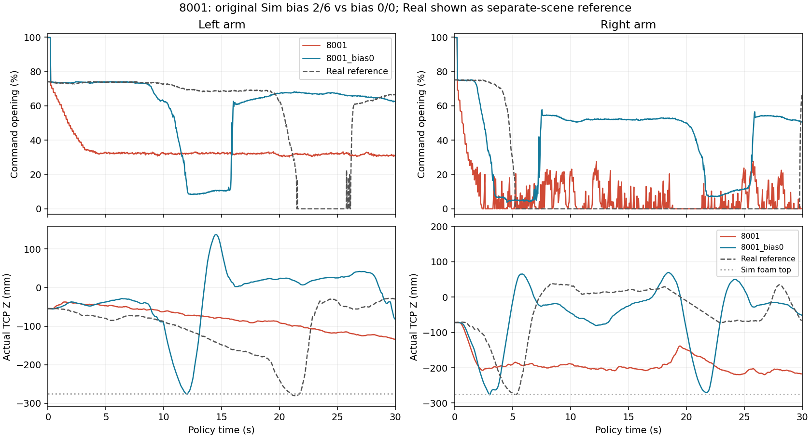
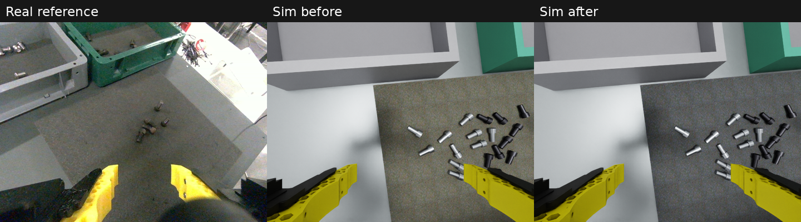

# 2026-09-06 공유 스택·폼 패드·bias 0 결과

이 디렉터리는 현재 작업의 대표 영상과 검증 기록을 Git에 보존한다.
원시 500Hz 로그와 전체 정책 입력은 로컬 `outputs/`에 있으며,
[manifest.json](manifest.json)에 원본 위치·서버/체크포인트·설정 hash가 있다.
절대 경로 및 프로세스 PID는 당시 기록이다. 다른 PC의 실행 위치나 현재 서버를 뜻하지 않는다.

## 최신 비교: 양손 bias 0

동일한 RB5/Pika v15, seed 100 aligned, 회색/검정 각 10개,
500×500×20mm 보정 폼 패드와 같은 카메라·제어·접촉 설정이다.
8002/8003은 새로 추론했고, 8001은 직전 bias 0 검증 실행을 비교에 재사용했다.

| 모델 | 체크포인트 | 정책 시간 | 최종 올바른 박스 안착 | 영상 |
|---|---|---:|---|---|
| 8001 | boltv2_plain_40k/39999 | 30.002초 | 회색 1 / 검정 0 | [8001](8001.mp4) |
| 8002 | boltv2_r5_40k/39999 | 30.002초 | 회색 0 / 검정 0 | [8002](8002.mp4) |
| 8003 | boltv2_griponly_40k/39999 | 30.002초 | 회색 1 / 검정 1 | [8003](8003.mp4) |

[세 모델 비교 MP4](8001_8002_8003_comparison.mp4)

박스 안착은 볼트의 머리·몸통 전체가 최종 박스 내벽 안쪽 및 윗면 아래에 있는지
계산하고 영상으로 확인했다. 8002는 볼트를 들어 올리지만 놓쳤다.
모든 실행에서 제어기 fault는 없었다. 8003은 결과 저장/Kit 종료 단계에서 shell 143을
반환했지만, 정책은 30.002초 완료했고 MP4는 모두 끝까지 918프레임을 디코딩했다.
개별 MP4는 960×720, 비교는 1920×550, 모두 30fps/30.6초다. 앞 0.6초는 tare다.

- [장면·설정·초기 자세·영상 검증](verification.json)
- [볼트별 상승·박스 안착 수치](task_metrics.json)
- [8001 실행 설정/요약](8001.summary.json), [8002](8002.summary.json), [8003](8003.summary.json)
- [8003의 velocity 마스킹 계약](server_input_contract.json)

이는 한 장면의 단일 실행 결과로 일반 성공률이나 모델 순위 검증은 아니다.

## 왜 기존 세 모델 영상에서 집지 못했는가

기존 Sim에는 과거 **gripper close bias L2/R6**이 남아 있었으나 Real 성공 설정은 **0/0**이었다.
공통 policy runner 코드를 사용하면서 별도 Sim 값으로 덮어쓴 설정 누락을 수정했다.
보정 후 그리퍼 명령을 다음 proprio로 되먹임하므로 bias는 닫힘 타이밍과 후속 동작에도 영향을 준다.

기존 8001의 원본 입력 재생은 15,301 physics ticks에서 실제/목표 관절 및 속도 차이가 0이었다.
그 실행은 손끝이 볼트보다 최소 34.39mm 높았고 접촉이 없었다. bias만 0으로 바꾼 새 실행은
회색 볼트를 최대 408.58mm 들어 올려 회색 박스에 놓았다.

- [bias 수정 전후 MP4](8001_bias_before_after.mp4)
- [상세 분석](bias_report.md) · [수치](bias_metrics.json)
- [원본 입력 재생 검증](replay_verification.json) · [손끝/볼트 기하](original_geometry_metrics.json)

Real 점선은 별도 실제 장면의 참고 궤적이다. 같은 물체 배치의 모터 응답 A/B가 아니다.
새 추론의 diffusion sample/서비스 지연은 고정하지 않았으며, 반복 성공률은 아직 측정하지 않았다.

## 이번 작업에서 보존한 진단 이력

아래 보고서는 당시 실행 기록을 원문으로 보존했다. 본문 `outputs/` 경로는 로컬 원본이며,
실행별 사용 장면·bias·제어 경로를 구분해야 한다. 과거 bare-table/잘못된 bias 결과를
위 최신 실행의 결과로 혼합하지 않는다.

1. [추종 fault와 Real–Sim 차이](tracking_fault_20260905.md)
2. [PhysX F/T·접촉·수거함 치수 수정](shared_contact_20260905.md)
3. [기존 8001 왼팔 파지 실패의 원본 입력 재생](grasp_8001_20260906.md)
4. [최근 실제 데이터에 맞춘 폼 환경](foam_scene_20260906.md)
5. [패드 색상 보정](foam_color_20260906.md)

## 남은 한계

최근 데이터 intrinsics는 fx≈393px, 현재 Sim은 ≈336px다. 카메라 pose는 CAD 기반이며,
패드/박스 pose·그리퍼 모터 응답·접촉 물성도 완전 실측이 아니다.
카메라 차이는 확인된 보정 대상이나 이번 bias 0 비교에서는 카메라를 변경하지 않았다.
실제 로봇/그리퍼 연결과 Real force/safety 설정 변경도 없다.
